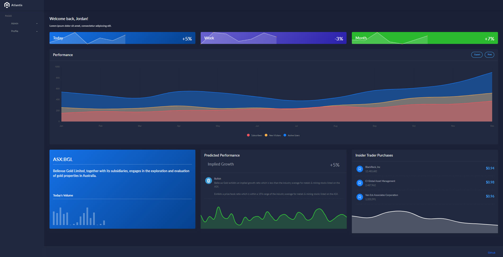

  
</br>

Live Demo:  http://fast-sea-13591.herokuapp.com/.
 
</br>

[WIP] A python web-application that evaluates portfolio holdings by screening company announcements (scraping -> BERT sentiment analysis) and implementing quant-analysis on stock charts for bearish/bullish pattern recognition.  The async RESTful API is built with FastAPI, and Postgres then deployed to Heroku using a Gunicorn WSGI server with integrated pytests & code coverage.

</br>



</br>

## Features
- [x] Containerize FastAPI and Postgres inside a Docker container and deploy the app to Heroku with continuous integration
- [x] Integrate article summary extraction (NLP) with [Newspaper3k](https://newspaper.readthedocs.io/) 
- [x] Run sentiment analysis on article summary with the [BERT Model](https://huggingface.co/docs/transformers/model_doc/bert) 
- [ ] Technical screening (candlestick pattern recognition -> return bearish/bullish indicator)
- [ ] Alerts and notification pushing
- [ ] Cached querying and profile summary

</br>

## Dev Objectives
- [x] Develop an asynchronous RESTful API with Python and FastAPI
- [x] Practice Test-Driven Development
- [x] Test a FastAPI app with pytest
- [x] Interact with a Postgres database asynchronously
- [x] Containerize FastAPI and Postgres inside a Docker container
- [x] Deploy dockerized app to Heroku
- [x] Run unit and integration tests with code coverage
- [x] Improve code quality with linter
- [x] Configure GitHub Actions for continuous integration and deployment
- [ ] Run tests in parallel
- [x] Configure index.html from [Atlantis-Lite UI template](https://github.com/themekita/Atlantis-Lite)

</br>


## Installation & Usage

<details>
  <summary>Requirements</summary>

</br>

- [Git](https://git-scm.com/) for command-line interface 
- [Pyenv](https://github.com/pyenv/pyenv) for Python version management tool
- [Poetry](https://python-poetry.org/docs/) for dependency management and packaging
- [Docker](https://docs.docker.com/get-docker/) for developing, shipping, and running applications
- [Heroku CLI](https://devcenter.heroku.com/articles/heroku-cli) for cloud deployment
</details>

</br>

<details>
  <summary>Reproduction on a local machine</summary>

</br>

- Clone the GitHub repository to an empty folder on your local machine:
    ```
    gh repo clone jordanhoare/fastapi-api
    ```
- Initialise poetry:
    ```
    poetry build
    ```
- Build a docker image and run the container in detached mode:
    ```
    docker-compose build
    docker-compose up -d
    docker-compose logs web
    ```
- Check the logs of the web service:
    ```
    docker-compose logs web
    ```
</details>

</br>


<details>
  <summary>Heroku Deployment</summary>

</br>

* fast-sea-13591: change to the name of the Heroku app 

- Login:
    ```
    heroku login
    ```
- Create a new app:
    ```
    heroku create
    ```
- Register container:
    ```
    heroku container:login
    ```
- Provision a Postgres database:
    ```
    heroku addons:create heroku-postgresql:hobby-dev --app
    ```
- Build the production image:
    ```
    docker build -f project/Dockerfile.prod -t registry.heroku.com/fast-sea-13591/web ./project
    ```
- Push image to registry:
    ```
    docker push registry.heroku.com/fast-sea-13591/web:latest
    ```
- Release the image:
    ```
    heroku container:release web --app fast-sea-13591
    ```
- Apply the migrations:
    ```
    heroku run aerich upgrade --app fast-sea-13591
    ```
</details>

</details>

</br>

</br>

## Useful Commands

<details>
  <summary>Useful docker commands</summary>

</br>

- Bring down the containers and volumes
    ```
    docker-compose down -v
    ```
- Build the image and spin up the two containers:
    ```
    docker-compose up -d --build
    ```
- Apply migration:
    ```
    docker-compose exec web aerich upgrade
    ```
- Access data tables via psql:
    ```
    docker-compose exec web-db psql -U postgres
    \c web_dev
    \dt
    ```
- With the containers up and running, run the tests:
    ```
    docker-compose exec web python -m pytest
    ```
- Generate schema via Tortoise:
    ```
    docker-compose exec web python app/db.py
    ```
- Create the first migration (Aerich init):
    ```
    docker-compose exec web aerich init-db
    ```
- Define entrypoint:
    ```
    chmod +x project/entrypoint.sh
    ```
- Code quality:
    ```
    docker-compose exec web black . --check
    docker-compose exec web isort . --check-only
    docker-compose exec web flake8 .
    ```
</details>

</br>

<details>
  <summary>Pytest commands</summary>

</br>

- Normal run
    ```
    docker-compose exec web python -m pytest
    ```
- Disable warnings
    ```
    docker-compose exec web python -m pytest -p no:warnings
    ```
- Run only the last failed tests
    ```
    docker-compose exec web python -m pytest --lf
    ```
- Run only the tests with names that match the string expression
    ```
    docker-compose exec web python -m pytest -k "summary and not test_read_summary"
    ```
- Stop the test session after the first failure
    ```
    docker-compose exec web python -m pytest -x
    ```
- Enter PDB after first failure then end the test session
    ```
    docker-compose exec web python -m pytest -x --pdb
    ```
- Stop the test run after two failures
    ```
    docker-compose exec web python -m pytest --maxfail=2
    ```
- Show local variables in tracebacks
    ```
    docker-compose exec web python -m pytest -l
    ```
- List the 2 slowest tests
    ```
    docker-compose exec web python -m pytest --durations=2
    ```
</br>

</details>

</br>

<details>
  <summary>Heroku commands</summary>

</br>

* fast-sea-13591: change to the name of the Heroku app 

- Provision a Postgres database:
    ```
    heroku addons:create heroku-postgresql:hobby-dev --app
    ```
- Build the production image:
    ```
    docker build -f project/Dockerfile.prod -t registry.heroku.com/fast-sea-13591/web ./project
    ```
- To test locally, spin up the container:
    ```
    docker run --name fastapi-tdd -e PORT=8765 -e DATABASE_URL=sqlite://sqlite.db -p 5003:8765 registry.heroku.com/fast-sea-13591/web:latest
        test @ http://localhost:5003/ping/
    ```
- Bring down the container:
    ```
    docker rm fastapi-tdd -f
    ```
- Push image to registry:
    ```
    docker push registry.heroku.com/fast-sea-13591/web:latest
    ```
- Release the image:
    ```
    heroku container:release web --app fast-sea-13591
    ```
- Apply the migrations:
    ```
    heroku run aerich upgrade --app fast-sea-13591
    ```
</details>

</br>

<details>
  <summary>Github Actions</summary>

</br>

- Build and tag the image:
    ```
    docker build -f project/Dockerfile.prod -t docker.pkg.github.com/<USERNAME>/<REPOSITORY_NAME>/summarizer:latest ./project
    ```
-  Authenticate to GitHub Packages with Docker:
    ```
    docker login docker.pkg.github.com -u <USERNAME> -p <TOKEN>
    ```
-  Push the image to the Container registry on GitHub Packages
    ```
    docker push docker.pkg.github.com/<USERNAME>/<REPOSITORY_NAME>/summarizer:latest
    ```
</details>

</br>

<details>
  <summary>HTTPie Tests</summary>

</br>

- GET single summary:
    ```
    http GET https://fast-sea-13591.herokuapp.com/summaries/1/
    ```
- GET all summaries:
    ```
    http GET https://fast-sea-13591.herokuapp.com/summaries/
    ```
- POST:
    ```
    http --json POST https://fast-sea-13591.herokuapp.com/summaries/ url=https://test.com
    ```
- PUT:
    ```
    http --json PUT https://fast-sea-13591.herokuapp.com/summaries/2/ url=https://test.com summary=super
    ```
- DELETE:
    ```
    http DELETE https://fast-sea-13591.herokuapp.com/summaries/2/
    ```


- PUT:
    ```
    http GET https://fast-sea-13591.herokuapp.com/summaries/
    http --json POST http://localhost:8004/summaries/ url=https://testerwebsite.io
    ```
- Test routes of deployed container with HTTPie:
    ```
    http --json POST https://fast-sea-13591.herokuapp.com/summaries/ url=https://testerwebsite.io
    ```
</details>

</br>
